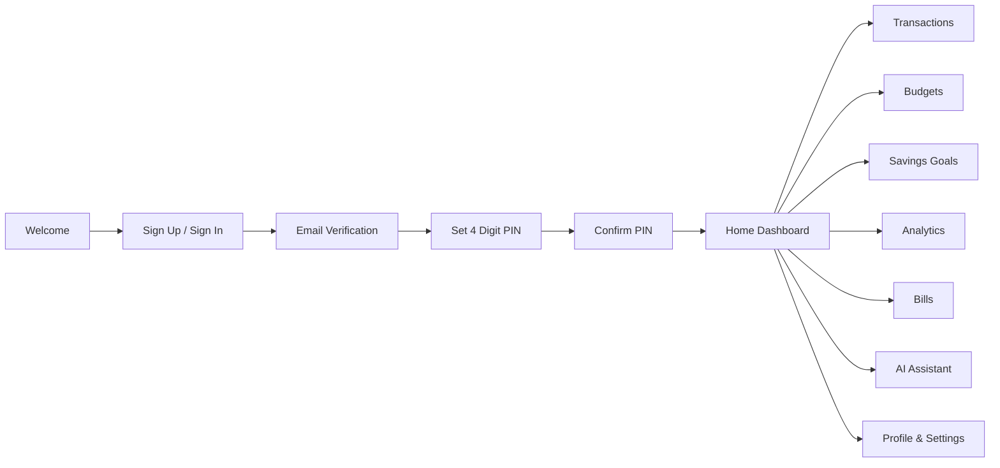

<div align="center">

# 💜 Saveony

### Personal Finance • Budgeting • Savings • Financial Insights

**Track. Save. Grow.**

A modern personal finance mobile application designed to help users manage their money, understand spending patterns, plan budgets, and build better saving habits.

<br/>

<a href="https://github.com/drashti231/SaveOny">

</a>
<a href="https://reactnative.dev/">

</a>
<a href="https://www.typescriptlang.org/">

</a>
<a href="https://expo.dev/">

</a>

<br/>


</div>

---

## ✨ What is Saveony?

**Saveony** is a modern personal finance tracker built to make everyday money management simple, visual, and secure.

Instead of only recording expenses, Saveony brings multiple financial activities into one place:

> **Income → Expenses → Budgets → Savings Goals → Bills → Analytics → Financial Insights**

The application focuses on a clean mobile-first experience with intuitive navigation, visual analytics, secure authentication, and personalized financial management.

---

## 📱 App Preview

<div align="center">

<table>
<tr>
<td align="center">

### 🏠 Dashboard


</td>

<td align="center">

### 💳 Transactions


</td>

<td align="center">

### 📊 Analytics


</td>
</tr>

<tr>
<td align="center">

### 🎯 Savings Goals


</td>

<td align="center">

### 💰 Budgets


</td>

<td align="center">

### 🤖 AI Assistant


</td>
</tr>
</table>

</div>

> 📌 **Tip:** Replace the screenshot filenames above with your actual screenshots.

---

# 🚀 Feature Highlights

<table>
<tr>

<td width="50%">

### 🔐 Authentication & Security

* Firebase Authentication
* Email verification
* Secure sign in / sign up
* 4-digit PIN protection
* Confirm PIN flow
* Biometric authentication support
* Secure local storage
* Session protection

</td>

<td width="50%">

### 💸 Money Management

* Income tracking
* Expense tracking
* Transfers
* Categories
* Payment methods
* Transaction history
* Recurring transactions
* Financial summaries

</td>

</tr>

<tr>

<td width="50%">

### 📊 Smart Dashboard

* Total balance
* Income overview
* Expense overview
* Recent transactions
* Spending summaries
* Financial trends
* Quick actions
* Visual insights

</td>

<td width="50%">

### 🎯 Savings Goals

* Create custom goals
* Target amount
* Current progress
* Goal deadline
* Progress tracking
* Emergency fund planning
* Vacation / purchase goals

</td>

</tr>

<tr>

<td width="50%">

### 💰 Budget Management

* Monthly budgets
* Category budgets
* Spending limits
* Remaining budget
* Budget progress
* Spending alerts
* Budget monitoring

</td>

<td width="50%">

### 🧾 Bills & Payments

* Bill management
* Due dates
* Payment tracking
* Recurring bills
* Bill reminders
* Subscription tracking
* Payment status

</td>

</tr>

<tr>

<td width="50%">

### 📈 Analytics & Reports

* Daily insights
* Weekly analysis
* Monthly reports
* Yearly overview
* Category spending
* Income vs expense
* Spending trends
* Financial reports

</td>

<td width="50%">

### 🤖 AI Financial Assistant

* Ask financial questions
* Spending insights
* Saving suggestions
* Expense analysis
* Budget guidance
* Financial summaries
* Personalized insights

</td>

</tr>
</table>

---

# 🧩 Core Modules

```text
Saveony
│
├── 🔐 Authentication
│   ├── Sign Up
│   ├── Sign In
│   ├── Email Verification
│   ├── PIN Setup
│   └── Biometric Lock
│
├── 🏠 Dashboard
│   ├── Balance
│   ├── Income
│   ├── Expenses
│   └── Recent Transactions
│
├── 💳 Transactions
│   ├── Income
│   ├── Expense
│   ├── Transfer
│   └── Recurring Transactions
│
├── 💰 Budgets
│   ├── Monthly Budget
│   ├── Category Budget
│   └── Budget Tracking
│
├── 🎯 Savings Goals
│   ├── Goal Creation
│   ├── Progress Tracking
│   └── Target Management
│
├── 🧾 Bills
│   ├── Add Bill
│   ├── Due Dates
│   └── Reminders
│
├── 📊 Analytics
│   ├── Spending Analysis
│   ├── Income Analysis
│   ├── Charts
│   └── Reports
│
├── 🤖 AI Assistant
│   └── Financial Insights
│
└── ⚙️ Profile & Settings
    ├── Security
    ├── Notifications
    └── Account Settings
```

---

# 🛠️ Tech Stack

<div align="center">

### 📱 Frontend


<br/><br/>

### 🔥 Backend & Services


<br/><br/>

### 🧰 Development


</div>

### Technology Details

| Technology                  | Purpose                           |
| --------------------------- | --------------------------------- |
| **React Native**            | Cross-platform mobile application |
| **Expo**                    | Development & application tooling |
| **TypeScript**              | Type-safe application development |
| **Firebase Authentication** | User authentication               |
| **Secure Storage**          | Sensitive local data protection   |
| **AsyncStorage**            | Local application persistence     |
| **Charts / Visualization**  | Financial analytics               |
| **AI Integration**          | Financial assistant & insights    |

---

# 🎨 Design System

Saveony uses a modern **Purple + Navy + Lavender** visual identity.

| Purpose        | Color     |
| -------------- | --------- |
| 💜 Primary     | `#6C4FF5` |
| 🟣 Accent      | `#7C3AED` |
| 🌌 Dark Navy   | `#172554` |
| 💡 Lavender    | `#EDE9FE` |
| 🏠 Background  | `#F8F9FF` |
| 💚 Income      | `#22C55E` |
| ❤️ Expense     | `#EF4444` |
| 💙 Accent Blue | `#38BDF8` |
| 📝 Text        | `#1E293B` |
| 🔲 Border      | `#E2E8F0` |

---

# 🔄 Application Flow



---

# 📊 Financial Dashboard

Saveony brings important financial information into one dashboard:

```text
┌───────────────────────────────────┐
│           Total Balance           │
│              ₹ XX,XXX             │
├───────────────────────────────────┤
│                                   │
│  Income              Expenses     │
│  ₹ XX,XXX             ₹ XX,XXX    │
│                                   │
├───────────────────────────────────┤
│       Spending Overview           │
│                                   │
│      📊 Category Analysis         │
│                                   │
├───────────────────────────────────┤
│        Recent Transactions        │
│                                   │
│  Food                    - ₹500   │
│  Salary                + ₹25,000  │
│  Shopping              - ₹1,200   │
└───────────────────────────────────┘
```

---

# 🔐 Security Flow

```text
New User
   │
   ▼
Create Account
   │
   ▼
Email Verification
   │
   ▼
Set PIN
   │
   ▼
Confirm PIN
   │
   ▼
Dashboard
```

Returning user:

```text
Open Saveony
     │
     ▼
PIN / Biometric
     │
     ▼
Home Dashboard
```

---

# 📂 Project Structure

```text
SaveOny/
│
├── artifacts/
│
├── lib/
│
├── package.json
├── pnpm-lock.yaml
├── pnpm-workspace.yaml
├── tsconfig.json
├── tsconfig.base.json
├── replit.md
└── README.md
```

---

# ⚡ Getting Started

## 1. Clone Repository

```bash
git clone https://github.com/drashti231/SaveOny.git
```

## 2. Navigate to Project

```bash
cd SaveOny
```

## 3. Install Dependencies

```bash
pnpm install
```

## 4. Start Expo

```bash
pnpm expo start
```

Then open the application using:

* 📱 Expo Go
* 🤖 Android Emulator
* 🍎 iOS Simulator
* 🌐 Web

---

# 🔑 Environment Configuration

Create your environment configuration according to the Firebase / AI services used by the project.

Example:

```env
FIREBASE_API_KEY=your_api_key
FIREBASE_AUTH_DOMAIN=your_auth_domain
FIREBASE_PROJECT_ID=your_project_id
FIREBASE_STORAGE_BUCKET=your_storage_bucket
FIREBASE_MESSAGING_SENDER_ID=your_sender_id
FIREBASE_APP_ID=your_app_id
```

> ⚠️ Never commit real API keys, private tokens, passwords, or service credentials to GitHub.

---

# 📱 Screens

| Screen            | Purpose                    |
| ----------------- | -------------------------- |
| 🏠 Home           | Financial overview         |
| 💳 Transactions   | Track income & expenses    |
| ➕ Add Transaction | Create financial records   |
| 💰 Budgets        | Manage spending limits     |
| 🎯 Goals          | Track savings targets      |
| 📊 Analytics      | Understand spending        |
| 🧾 Bills          | Manage upcoming payments   |
| 🤖 AI Assistant   | Financial guidance         |
| 👤 Profile        | Account management         |
| ⚙️ Settings       | App preferences & security |

---

# 🌱 Future Roadmap

* [ ] Advanced recurring transactions
* [ ] Improved notification system
* [ ] More detailed financial reports
* [ ] PDF report export
* [ ] CSV export
* [ ] Multiple financial accounts
* [ ] Advanced subscription tracking
* [ ] More AI-powered insights
* [ ] Cloud data synchronization improvements
* [ ] Dark mode improvements
* [ ] Advanced biometric security

---

# 🎯 Project Goals

Saveony is designed around three simple principles:

### 01 — Track

Know where your money comes from and where it goes.

### 02 — Understand

Use analytics and reports to understand spending behavior.

### 03 — Grow

Set budgets and savings goals to build healthier financial habits.

---

# 💡 Why Saveony?

Most basic expense trackers focus only on recording transactions.

Saveony aims to provide a more complete financial experience by combining:

**Transactions + Budgets + Savings + Bills + Analytics + AI**

into a single modern mobile application.

---

# 👩‍💻 Developer

<div align="center">

### Drashti Vaghela

**BSc IT • Full Stack Developer • Mobile App Developer**

Building practical applications with modern technologies.

<br/>

<a href="https://github.com/drashti231">

</a>

<a href="https://linkedin.com/in/drashti-vaghela-2626a7341/">

</a>

</div>

---

# ⭐ Support

If you find Saveony useful or interesting:

⭐ **Star this repository**

🍴 **Fork the project**

💡 **Share feedback**

🐛 **Report issues**

---

<div align="center">

### 💜 Saveony

**Track. Save. Grow.**

Built with ❤️ using React Native, TypeScript & modern technologies.

<br/>


</div>
## 📱 Download Saveony

<div align="center">

### 🚀 Try Saveony

Experience the Saveony personal finance tracker directly on your Android device.

<br/>

<a href="YOUR_APK_LINK">

</a>

<a href="YOUR_APP_DEMO_LINK">

</a>

<br/><br/>

**Android APK • Personal Finance • Budgeting • Savings • Analytics**

</div>

### 📦 APK Installation

1. Download the latest **Saveony APK**.
2. Open the downloaded `.apk` file on your Android phone.
3. Allow installation from unknown sources if Android asks.
4. Install and open **Saveony**.
5. Create an account and start managing your finances.

> ⚠️ Download APK files only from the official project release/source.

---

## 🔗 Project Links

| Resource             | Link                                                      |
| -------------------- | --------------------------------------------------------- |
| 📦 APK Download      | [Download Saveony APK](YOUR_APK_LINK)                     |
| 💻 GitHub Repository | [View Source Code](https://github.com/drashti231/SaveOny) |
| 🌐 Live Demo         | [Open Saveony](YOUR_APP_DEMO_LINK)                        |
| 👩‍💻 Developer      | [Drashti Vaghela](https://github.com/drashti231)          |
